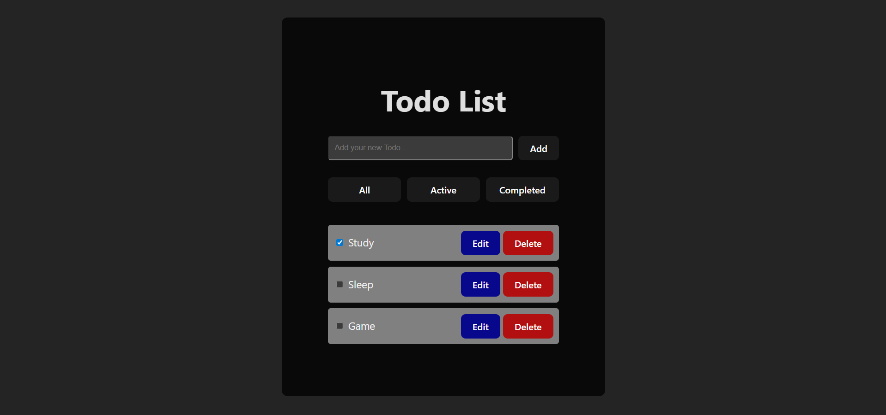

# Simple React Todo List App 📝

Sebuah aplikasi daftar tugas (Todo List) interaktif yang dibangun menggunakan React. Proyek ini mencakup fungsionalitas dasar CRUD (Create, Read, Update, Delete) dan fitur-fitur modern seperti state management dengan React Hooks dan rendering dinamis.



---

### ✨ Live Demo

You can try out the live calculator here:
**[simple-project-mobile-calculator.netlify.app](https://simple-todo-list1.netlify.app/)**

---

## ✨ Fitur

* **Tambah Tugas**: Menambahkan tugas baru ke dalam daftar.
* **Hapus Tugas**: Menghapus tugas yang sudah ada.
* **Edit Tugas**: Mengubah nama atau deskripsi dari tugas yang sudah ada.
* **Tandai Selesai**: Memberi centang pada tugas untuk menandainya sebagai selesai, lengkap dengan gaya visual (teks tercoret).
* **Filter Tampilan**: Menyaring daftar tugas untuk menampilkan "Semua", "Aktif", atau "Selesai".
* **Struktur Komponen**: Dibangun dengan memecah UI menjadi komponen-komponen yang dapat dikelola.

---

## 🛠️ Teknologi yang Digunakan

* **React**: Library JavaScript untuk membangun antarmuka pengguna.
* **Vite**: Alat bantu modern untuk pengembangan frontend.
* **JavaScript (ES6+)**: Bahasa pemrograman utama.
* **CSS3**: Untuk styling dan tata letak.

---

## 🚀 Memulai Proyek

Untuk menjalankan proyek ini di komputer lokal Anda, ikuti langkah-langkah berikut.

### Prasyarat

Pastikan Anda sudah menginstal Node.js dan npm (atau yarn) di mesin Anda.

### Instalasi

1.  **Clone repositori ini**
    ```sh
    git clone [https://github.com/NAMA_USER_ANDA/NAMA_REPO_ANDA.git](https://github.com/NAMA_USER_ANDA/NAMA_REPO_ANDA.git)
    ```
2.  **Masuk ke direktori proyek**
    ```sh
    cd NAMA_REPO_ANDA
    ```
3.  **Install semua paket yang dibutuhkan**
    ```sh
    npm install
    ```
4.  **Jalankan server development**
    ```sh
    npm run dev
    ```

Buka [http://localhost:5173](http://localhost:5173) (atau port lain yang muncul di terminal Anda) di browser untuk melihat hasilnya.

---

## 📄 Lisensi

Didistribusikan di bawah Lisensi MIT.
